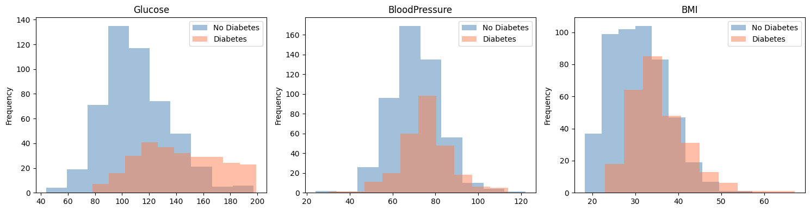

# Diabetes Risk Predictor

A machine learning project that predicts **diabetes risk** from patient medical data. Built as part of my self-directed ML learning path, this was my first end-to-end ML project covering data cleaning, exploratory analysis, model training, and evaluation.

---

## Motivation

Diabetes affects over **400 million people** worldwide, and **early detection** is critical for preventing serious complications. This project explores whether a machine learning model trained on basic medical measurements can reliably flag patients at risk, with a focus on minimizing **false negatives** since missing a real diagnosis is far more dangerous than a false alarm.

---

## Dataset

**Pima Indians Diabetes Database**, available on [Kaggle](https://www.kaggle.com/datasets/uciml/pima-indians-diabetes-database)

- **768 patients**, all female, age 21+
- **8 original features**: Glucose, BloodPressure, SkinThickness, Insulin, BMI, DiabetesPedigreeFunction, Age
- Binary outcome: 1 = diabetic, 0 = not diabetic

---

## Data Cleaning

A key finding during exploration was that several columns contained zeros that were **biologically impossible**. A living person cannot have a glucose level, BMI, or blood pressure of zero. These were **missing values disguised as zeros**.

**Approach:**

- `Glucose`, `BloodPressure`, `BMI` — low number of zeros (5, 35, 11), replaced with **column median**
- `Insulin`, `SkinThickness` — **over 40% zeros**, dropped entirely to avoid training on fabricated data

---

## Key Finding from Exploration

**Glucose** was by far the strongest predictor of diabetes risk. The distribution of glucose values for diabetic vs non-diabetic patients showed the clearest separation of any feature, consistent with the medical reality that **high blood glucose** is the defining characteristic of diabetes.



---

## Models and Results

Four approaches were evaluated, progressively optimizing for **recall** on the diabetic class (class 1) since missing a real diagnosis is the most dangerous type of error.

| Model                                    | Accuracy | Class 1 Precision | Class 1 Recall | False Negatives |
| ---------------------------------------- | -------- | ----------------- | -------------- | --------------- |
| Logistic Regression                      | 0.75     | 0.67              | 0.62           | 21              |
| Random Forest                            | 0.77     | 0.68              | 0.69           | 17              |
| Random Forest (balanced)                 | 0.77     | 0.67              | 0.71           | 16              |
| Random Forest (balanced + threshold 0.3) | 0.75     | 0.61              | **0.85**       | **8**           |

**Chosen model: Random Forest with class balancing and a 0.3 decision threshold**

Lowering the decision threshold from **0.5 to 0.3** means the model flags a patient as diabetic if it estimates a **30% or greater probability** rather than requiring 50% confidence. Combined with **class weight balancing** (which penalizes missing diabetic patients more heavily during training), this configuration catches **47 out of 55 diabetic patients** in the test set, cutting missed diagnoses from **21 to 8** compared to the baseline.

The tradeoff is more false positives (30 vs 17 for baseline), but in a medical screening context an unnecessary follow-up test is a far better outcome than a **missed diagnosis**.

---

## Setup and Installation

**Prerequisites:** Python 3.11+, Git

```bash
# Clone the repository
git clone https://github.com/vuongj321/diabetes-prediction.git
cd diabetes-risk-predictor

# Create and activate virtual environment
python -m venv venv
venv\Scripts\activate  # Windows
source venv/bin/activate  # Mac/Linux

# Install dependencies
pip install -r requirements.txt
```

Download `diabetes.csv` from [Kaggle](https://www.kaggle.com/datasets/uciml/pima-indians-diabetes-database) and place it in the project root, then open `diabetes.ipynb` in VS Code or Jupyter.

---

## What I Learned

- Real-world data is messy. Spotting and handling **disguised missing values** was one of the most important steps in the project
- **Accuracy is a misleading metric** for imbalanced medical datasets. Recall on the minority class matters far more
- The **decision threshold** is a values decision as much as a technical one. How you set it reflects the real-world cost of each type of error
- **Random Forest outperformed Logistic Regression** here likely because the relationship between features and diabetes risk is nonlinear

---

## Next Steps

- Explore feature engineering (e.g. glucose/BMI interaction terms)
- Try Gradient Boosting / XGBoost
- Hyperparameter tuning with grid search
- Build a simple web interface for patient input and risk prediction
